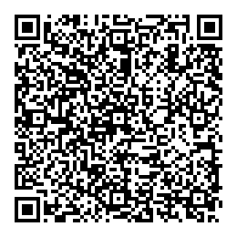
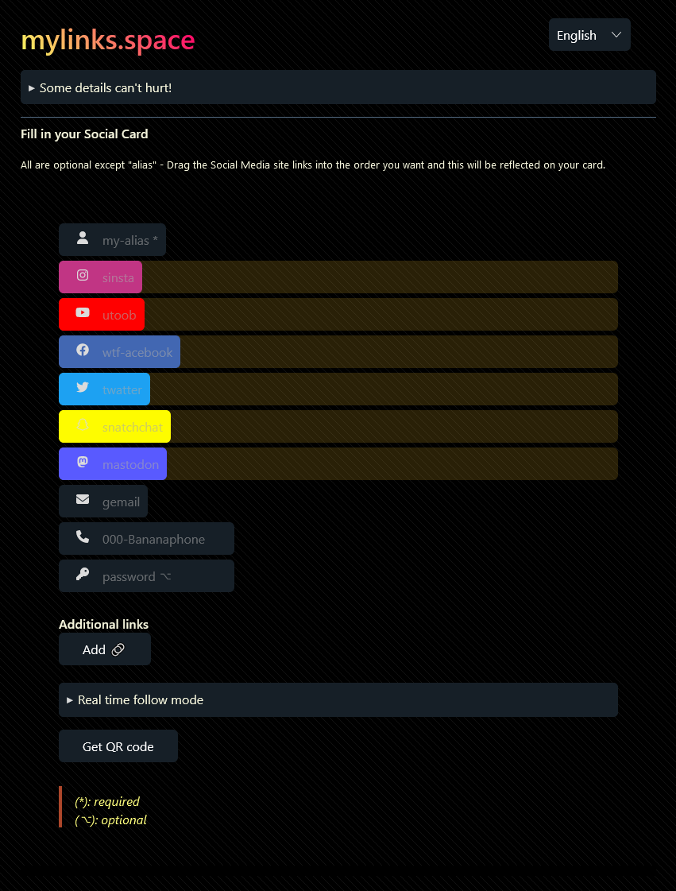
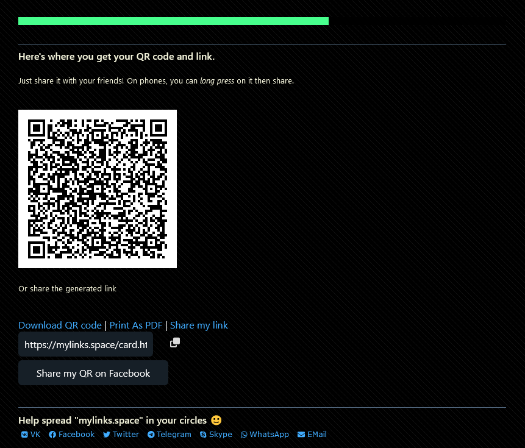

# MyLinks

A **No server** social cards sharing web app 

## Social card

- It's like "contact address" with social media usernames (Snapchat, Facebook, Twitter, Instagram, Phone, etc.)

- It can be used to share contacts in less than a minute with anyone using a QR Code

- **No server**: It does not send data from users browsers anywhere; Still, users can share their cards

- It just uses URLs and QR Code. Even the generated URLs cannot be logged by design (URL only serve assets, card data is encoded as `https://mylinks.space#data` -- the part after `#` lives only in the browser)

- **Real time mode**: When creating a card, user can activate (opt-in) the *real time mode*, spread the card to the world and at the same time sees people visiting the card. This is experimental and uses Bittorrent protocol to p2p connect browsers (signaling server / no data shares), this is implemented thanks to [trystero](https://github.com/dmotz/trystero).

## Example

A QR is like this:

For the following link:

https://mylinks.space/card.html#YmFjbG91ZDIzLG15U2luc3RhR3JhbSxteVlvdUJlZVRvb2Isd3RGYWNlQm9vayxUd2F0dGVyQXNXZWxsLFNuYXRjaCxtb25zdGVyRG9uLG1haWxAbWFpbC5jb20sMDg4ODg4ODg4OA==@5586889211234561

The initial card is like:

The rendered social card is like this:

## TODOs

- I'm struggling to have the right PWA manifest part of the Parcel build process.
- Better design
- Finishing with some bugs (decrypt a card twice)
- Shrink the bundle size especially with the imported `@fortawesome/fontawesome-free/js/all`

## License
MIT   
Algebra-insights Inc.  
France 2023

If you have any questions about our projects you can email yanna92yar@gmail.com

